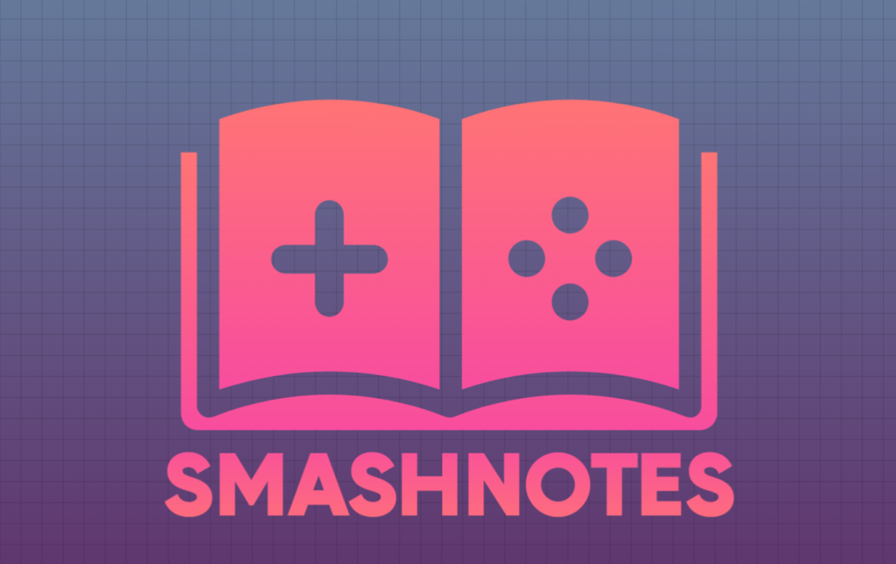

# Smash Notes 

> Store your Super Smash Bros. notes on matchups

## Install

`npm install`  
`ionic serve -l`  

# Setup Firebase

Edit .env.sample to .env  
Plug in your firebase configuration for each of the environment variables  

## Technologies

1. Firebase 
2. Angular 12
3. Ionic  